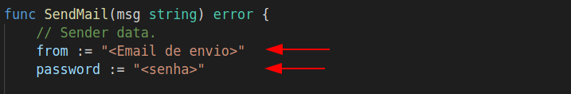
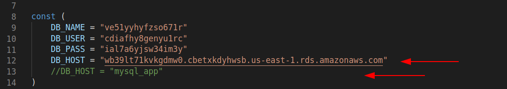
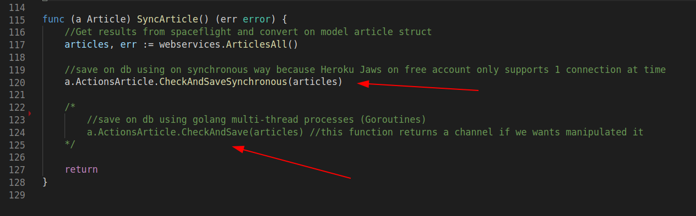

<p align="center"><a href="https://easycredito.com.br" target="_blank"></a></p>

<h2 align="center">Projeto Back-end Challenge 🏅</h2>
<p align="center">Escrito em GoLang com  Echo Framework </p>
<p align="center">Módulo EasyCrédito para integração com a API Space Flight News</p>

<p align="center">
<a href="#install">Instalação</a> •
<a href="#docs">Documentação</a> • 
<a href="#tests">Testes</a> • 

## Instalação
<div id="install">
<p>Para instalação é necessário que o docker e docker-compose estejam devidamente instalados em sua máquina</p>
<p>O sistema está configurado para iniciar no localhost (127.0.0.1) porta 8000, e o mysql iniciará na porta 3306, certifique-se que estas portas estejam livres antes de iniciar a instalação.</p>
<p>1. Entre na pasta do projeto: </p>

```
cd easycredito_app
```
<p>2. Iremos subir os containeres utilizando o docker-compose: </p>   

```
docker-compose up
```

</div>

## Documentação
<div id="docs">
<h3>OpenApi</h3>
<p>Link para documentação da api padrão OAS v3: <a href="https://app.swaggerhub.com/apis-docs/brenddonanjos/EasyCredito/1.0.0">CLIQUE AQUI</a></p>

<h3>Apresentação em vídeo</h3>
<p>Link para apresentação rápida do projeto: <a href="https://www.loom.com/share/6dce8c3711a6468abcf7c78b7f01a280">https://www.loom.com/share/6dce8c3711a6468abcf7c78b7f01a280</a></p>

<h3>Modelo EER</h3>
<p>No diretório  <b>/docs</b> estará disponibilizado um diagrama EER do banco de dados</p>

<h3>Acesso via Postman</h3>
<p>Para requisições personalizadas e testes de casos específicos no diretório <b>/docs</b> foi disponibilizado uma collection e um enviroment para acesso via postman</p>
<p>Para visualização da collection é necessário que o postman esteja devidamente instalado na em máquina</p>
<p>1. Com o programa aberto importe a collection <b>go_easycredito_app.postman_collection</b> clicando no botão "import" no canto superior esquerdo.</p>
<p>2. Agora importe o envirnoment <b>go_easycredito_app.postman_environment.json</b> e selecione o environment importado no canto superior esquerdo</p>

<h3>Configurar email para aviso de erro (Sincronização com SpaceFlightNews)</h3>
<p>O sistema possui a funcionalidade de enviar emails caso ocorra erros na sincronização, para configurar é necessário informar um email e senha para isso acesse o arquivo: <b>/src/actions/util.go  - linhas 13 e 14</b> </p>

<p>Altere os valores das variáveis <b>from</b> e <b>password</b> com informações de autenticação válida. </p>

<p>Talves seja necessário ativar a permissão para apps menos seguros no email informado, caso use gmail é possível acessar nesse <a href="https://myaccount.google.com/lesssecureapps" target="_blank">link</a></p>

<h3>OBSERVAÇÃO IMPORTANTE !</h3>
<p>O processo de sincronização foi originalmente desenvolvido utilizando os processos multi thread do GoLang (Goroutines), porém o banco de dados versão grátis Jaws Heroku permite apenas uma conexão/operação por vez, impossibilitando o registro no banco utilizando mais de uma thread</p>
<p>Caso queiramos testar este processo foi configurado um container Mysql para conexão com banco local. Para configurar o banco local precisaremos seguir alguns passos:</p>
<p>Acesse o arquivo <b>/src/database/database.go</b> e mude o valor da constante <b>DB_HOST</b> para <b>"mysql_app"</b></p>

<p>Acesse o arquivo <b>/src/handlers/article.go</b>, após isso na função <b>SyncArticle()</b> altere a chamada de <b>CheckAndSaveSynchronous(articles)</b> para <b>CheckAndSave(article)</b></p>

</div>

## Testes
<div id="tests">
<p>Para executarmos os testes unitários com o sistema já em funcionamento entraremos no diretório que contém o arquivo de testes e executaremos o comando go para iniciar o processo</p>

```
cd src/handlers
```

```
go test
```
<p>Caso desejamos rodar os testes individualmente executaremos o seguinte comando:</p>

```
go test -v -run <NomeDaFuncaoTeste>
```


</div>

<h3>Tecnologias utilizadas</h3>
<p>As seguintes tecnologias foram usadas na construção do projeto:</p>

- [GoLang](https://go.dev/)
- [Echo](https://echo.labstack.com/)
- [Docker](https://www.docker.com/)
- [Mysql](https://www.mysql.com/)

> This is a challenge by [Coodesh](https://coodesh.com/)
